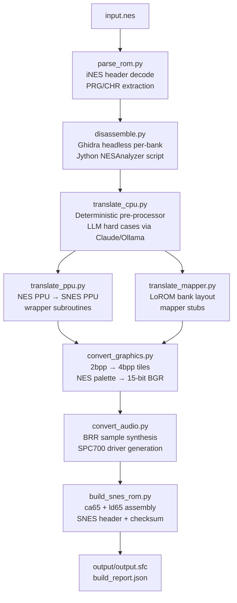

# rompipe

**rompipe** is a fully automated NES → SNES ROM port pipeline for Apple Silicon macOS. Feed it any `.nes` file and it produces a playable `.sfc` SNES ROM — with enhanced 16-bit color graphics and stereo SPC700 audio — entirely via local CLI tools and LLM-assisted code translation.

## 🎮 Features

- **Full Port, Not Emulation** — Translates 6502 machine code to 65816 ASM; does not wrap a NES emulator
- **LLM-Assisted Translation** — Uses Claude API or **local Ollama** to handle complex cases: NMI handlers, self-modifying code, indirect jumps, mapper IRQ logic
- **Ghidra-Powered Disassembly** — Per-bank headless analysis with function boundary detection, call graph extraction, and hardware register access mapping
- **Enhanced Output** — SNES 4bpp color (vs NES 2bpp), stereo SPC700 audio (vs mono APU)
- **79% Mapper Coverage** — NROM, MMC1, UNROM, CNROM, MMC3; graceful diagnostic output for unsupported mappers
- **Apple Silicon Native** — All tooling (cc65, Ghidra, Python packages) runs ARM64 natively; no Rosetta
- **Optional AI Upscaling** — ComfyUI + ControlNet Tile pass for HD sprite generation (requires local ComfyUI)

---

## 🏗 Architecture



---

## ⚙️ Pipeline Stages

| # | Script | Input | Output | Key Technology |
|---|--------|-------|--------|----------------|
| 1 | `parse_rom.py` | `.nes` file | `rom_manifest.json`, `prg_rom.bin`, `chr_rom.bin` | Python `struct` |
| 2 | `disassemble.py` | `prg_rom.bin` | `disasm/bank_NN.asm`, `functions.json`, `register_accesses.json` | Ghidra headless (Jython) / pure-Python fallback |
| 3 | `translate_cpu.py` | `disasm/*.asm` | `translated/bank_NN_65816.asm`, `translation_log.json` | Deterministic pre-processor + Claude API / Ollama |
| 4 | `translate_ppu.py` | `rom_manifest.json` | `ppu_wrappers.asm`, `ppu_init.asm` | Code generation (register mapping table) |
| 5 | `translate_mapper.py` | `rom_manifest.json` | `mapper_stubs.asm`, `bank_layout.json` | Per-mapper stub generators |
| 6 | `convert_graphics.py` | `chr_rom.bin` | `chr_snes.bin`, `palette_snes.bin`, `tile_NNNN_nes.png` | Pillow, NumPy |
| 7 | `convert_audio.py` | `prg_rom.bin`, `disasm/` | `spc_driver.asm`, `brr_samples/*.brr` | NumPy, SciPy |
| 8 | `build_snes_rom.py` | All workspace files | `output/output.sfc` | ca65, ld65 (cc65 toolchain) |

---

## 🗺 Supported NES Mappers

| Mapper | Name | Commercial Coverage |
|--------|------|-------------------|
| 0 | NROM | ~10% (Donkey Kong, Balloon Fight, etc.) |
| 1 | MMC1 | ~28% (Legend of Zelda, Metroid, Mega Man 2) |
| 2 | UNROM | ~11% (Mega Man, Castlevania, DuckTales) |
| 3 | CNROM | ~6% (Gradius, Q*bert) |
| 4 | MMC3 | ~24% (Super Mario Bros. 3, Kirby's Adventure) |

**Combined: ~79% of all commercially released NES titles.**
Unsupported mappers produce a diagnostic `.sfc` stub and report in `build_report.json`.

---

## 🚀 Quick Start

### 1. Prerequisites

```bash
# Assembler/linker — ARM64 native
brew install cc65

# Java 21 (required for Ghidra — NOT Java 25+)
brew install openjdk@21

# Ghidra disassembler
brew install --cask ghidra
# If Ghidra is not available via cask, download from GitHub:
# https://github.com/NationalSecurityAgency/ghidra/releases
# Extract to /opt/homebrew/share/ghidra_11.3.2_PUBLIC/

# Python dependencies
pip3 install -r requirements.txt
```

### 2. Choose your LLM backend

**Option A: Claude API (best quality, requires API key)**
```bash
cp .env.example .env
# Edit .env — set ANTHROPIC_API_KEY=sk-ant-...
python3 main.py your_game.nes
```

**Option B: Local Ollama (free, no API key needed)**
```bash
# Install Ollama if not already installed
brew install ollama
ollama pull qwen2.5-coder:14b

# Run with local LLM
python3 main.py your_game.nes --backend ollama
```

**Option C: No LLM (deterministic translation only)**
```bash
python3 main.py your_game.nes --no-llm
```

### 3. Run the pipeline

```bash
python3 main.py your_game.nes --backend ollama
```

Output will be at `output/output.sfc`. Open in any SNES emulator (Snes9x, bsnes, RetroArch).

### 4. Web Dashboard (recommended)

Monitor the pipeline in real time via a beautiful dark-themed web UI:

```bash
python3 dashboard.py your_game.nes --backend ollama
```

Opens `http://localhost:5555` in your browser automatically. Shows:
- Live stage progress with animated indicators
- Streaming LLM token output as translation happens
- ROM metadata, tile conversion progress, build results
- Full scrollable pipeline log

All the same CLI flags as `main.py` apply, plus `--port` and `--no-browser`.

### 5. Optional: AI upscaled sprites

Requires ComfyUI running locally on port 8188 with an SDXL checkpoint and ControlNet Tile model.

```bash
# Start ComfyUI first (in a separate terminal)
cd ~/ComfyUI && python3 main.py --force-fp16

# Then run with upscale flag
python3 main.py your_game.nes --upscale
```

---

## 🔧 Configuration

All options are CLI flags on `main.py`:

```
python3 main.py <input.nes> [options]

Options:
  --workspace DIR      Working directory (default: workspace/)
  --output DIR         Output directory (default: output/)
  --backend BACKEND    LLM backend: anthropic or ollama (default: anthropic)
  --upscale            Upscale CHR tiles via ComfyUI (requires port 8188)
  --skip-audio         Skip audio conversion (produces silent ROM)
  --no-llm             Disable LLM pass (faster, deterministic only)
  --claude-model MODEL LLM model name (default: claude-sonnet-4-6 / qwen2.5-coder:14b)
  --mapper-override N  Override mapper auto-detection
```

Dashboard mode (same flags plus dashboard-specific options):

```
python3 dashboard.py <input.nes> [options]

Additional options:
  --port PORT          Dashboard port (default: 5555)
  --no-browser         Don't auto-open browser
```

Individual stages can also be run in isolation (useful for debugging):

```bash
python3 parse_rom.py game.nes
python3 disassemble.py
python3 translate_cpu.py --backend ollama
python3 build_snes_rom.py
```

---

## 📂 Project Structure

```
rompipe/
├── main.py                    # Orchestrator — runs all 8 stages
├── parse_rom.py               # Stage 1: iNES header decode
├── disassemble.py             # Stage 2: Ghidra/capstone disassembly
├── translate_cpu.py           # Stage 3: 6502 → 65816 translation
├── translate_ppu.py           # Stage 4: NES PPU wrapper generation
├── translate_mapper.py        # Stage 5: mapper bank-switch stubs
├── convert_graphics.py        # Stage 6: CHR 2bpp → SNES 4bpp
├── convert_audio.py           # Stage 7: NES APU → SPC700 BRR
├── build_snes_rom.py          # Stage 8: ca65/ld65 ROM assembly
├── dashboard.py               # Real-time web dashboard (Flask + SSE)
├── test_dashboard.py          # Dashboard test with mock pipeline data
├── requirements.txt           # Python dependencies
├── scripts/
│   ├── NESAnalyzer.py         # Ghidra headless Jython script
│   ├── NESAnalyzer.java       # Ghidra Java script (legacy, OSGi issues)
│   └── lorom.cfg              # ld65 LoROM linker config template
├── .env.example               # API key template
├── CLAUDE.md                  # AI assistant instructions
└── README.md
```

Runtime directories (auto-created, git-ignored):

```
workspace/                     # All intermediate files
├── rom_manifest.json
├── prg_rom.bin / chr_rom.bin
├── disasm/                    # bank_NN.asm, functions.json, register_accesses.json
├── translated/                # bank_NN_65816.asm, translation_log.json
├── tiles/                     # tile_NNNN_nes.png
├── audio/                     # spc_driver.asm, brr_samples/
├── ppu_wrappers.asm / ppu_init.asm / mapper_stubs.asm
└── bank_layout.json / master.asm
output/
├── output.sfc                 # Final SNES ROM
├── build_report.json          # Full pipeline report
└── pipeline.log
```

---

## 📋 Build Report

Every run produces `output/build_report.json`:

```json
{
  "input_rom": "zelda.nes",
  "mapper": { "id": 1, "name": "MMC1 (SxROM)", "supported": true },
  "output_rom": "output/output.sfc",
  "stages": [
    { "stage": "parse_rom",        "success": true,  "elapsed_seconds": 0.04 },
    { "stage": "disassemble",      "success": true,  "elapsed_seconds": 31.6 },
    { "stage": "translate_cpu",    "success": true,  "elapsed_seconds": 171.7 },
    { "stage": "translate_ppu",    "success": true,  "elapsed_seconds": 0.07 },
    { "stage": "translate_mapper", "success": true,  "elapsed_seconds": 0.03 },
    { "stage": "convert_graphics", "success": true,  "elapsed_seconds": 0.06 },
    { "stage": "convert_audio",    "success": true,  "elapsed_seconds": 0.08 },
    { "stage": "build_snes_rom",   "success": true,  "elapsed_seconds": 0.05 }
  ],
  "warnings": [],
  "fidelity_estimate": "HIGH",
  "total_elapsed_seconds": 203.6
}
```

`fidelity_estimate` values: `HIGH` · `PARTIAL` · `DEGRADED` · `TRANSLATION_FAILED` · `BUILD_FAILED` · `UNSUPPORTED_MAPPER`

---

## 🔬 Technical Details

### Disassembly (Ghidra Integration)

Each 16KB NES PRG bank is loaded into Ghidra separately at the correct CPU address:
- **Switchable banks** (0 to N-1): loaded at `$8000`
- **Fixed last bank**: loaded at `$C000`

The `NESAnalyzer.py` Jython script runs as a Ghidra post-analysis hook and exports:
- Function boundaries with caller/callee relationships
- Per-function source assembly (used as LLM context)
- All NES hardware register access sites (`$2000`-`$4017`)
- Per-bank `.asm` disassembly listings with function labels

**Note:** Ghidra 11.x requires **Java 21 LTS**. Homebrew's default `openjdk` (Java 25) causes OSGi class loader failures. Install `openjdk@21` explicitly.

### CPU Translation (6502 → 65816)

**Pass 1 — Deterministic pre-processor:**
- Normalizes Ghidra `0x` hex notation to ca65 `$` prefix
- Expands all conditional branches to inverted-branch + JMP (avoids ±127 range limit)
- Replaces NES hardware register reads/writes with `JSR` wrapper calls
- Injects 65816 init preamble at RESET handler: `CLC; XCE` (native mode), stack setup, Direct Page = `$0000`

**Pass 2 — LLM translation (Claude API or Ollama):**
- Each Ghidra-identified function is sent individually with full source ASM context
- LLM output is validated with `ca65 --cpu 65816` before inclusion
- Failed validations fall back to `BRK` stub (safe crash vs silent corruption)
- All translations wrapped in `.ifndef` guards to prevent duplicate symbols across banks

### SNES ROM Format

- **LoROM** layout: 32KB banks at `$XX8000`-`$XXFFFF`
- Internal header at file offset `$7FC0` (21-byte title, map mode, ROM size)
- Checksum at `$7FDC`-`$7FDF`: complement field set to `$FFFF`, checksum to `$0000` before summing
- ROM padded to next power-of-2 size
- Native + emulation mode interrupt vectors at `$FFE0`-`$FFFF` within BANK00

---

## ⚠️ Limitations

- **Mapper coverage**: ~21% of NES titles use unsupported mappers and will produce non-booting stubs
- **Timing accuracy**: NES games use cycle-exact PPU timing. SNES timing differs; raster effects (mid-scanline palette swaps, sprite multiplexing tricks) may render incorrectly
- **Self-modifying code**: Flagged and sent to LLM but may not translate perfectly; check `translation_log.json` for `; REVIEW:` annotations
- **CHR-RAM games**: Games with no CHR-ROM (e.g., some MMC1 titles like Zelda 1) skip the graphics conversion step
- **Audio fidelity**: SPC700 BRR synthesis approximates NES APU channels — it will sound similar but not identical
- **Local LLM quality**: `qwen2.5-coder:14b` via Ollama is the recommended local model for 16GB RAM Macs. Claude API produces significantly better translation results

---

## 📜 License

This project is for educational and research purposes. Do not use with ROMs you do not own.
